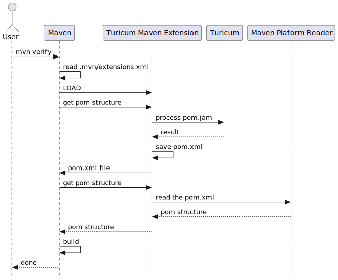

= Turicum Maven Extension

This module lets you maintain your `pom.xml` files using Turicum macros.

[WARNING]
====
This project is a Maven extension.
Maven extensions run before Maven, and they are different from Maven plugins.
The Turicum project supports Maven providing an extension.
====

Create a `.mvn` in your project root to use this module.
This directory will contain the file `extensions.xml` with the content:

[source,xml]
----
<?xml version="1.0" encoding="UTF-8"?>
<extensions>
    <extension>
        <groupId>ch.turicch.turic</groupId>
        <artifactId>turicum-maven-extension</artifactId>
        <version>1.0.1-SNAPSHOT</version>
    </extension>
</extensions>
----

When you start Maven, it will read the `pom.turi` file, convert it using Turicum and create the `pom.xml` file.

[NOTE]
====
The actual process is the following.
When a user invokes Maven, it looks at the `.mvn/extensions.xml` file, and it sees that the Turicum Maven Extension is configured there.
It loads the Turicum Maven Extension and invokes it to locate the POM file.
This call assumes that the POM file is already there, and at this point, the extension is supposed to find it.
The Turicum Maven Extension cheats a bit.
First it reads the Turicum source files, and it creates the `pom.xml` file.
The processing includes the resolution of all the macros and the formatting of the final XML result.
When the extension is done with this step, it writes the `pom.xml` file and returns the file reference as a Java `File` object.

Maven later asks for the extension to load the project object model from this file.
The extension knows at this point that the generated `pom.xml` file is a standard XML formatted pom, and it simply asks the standard Maven Platform Reader to read it.
When the Maven Platform Reader returns with the object model, the extension passes it back to Maven, and the rest is standard Maven business as usual.

NOTE: This way you can have the `pom.xml` file and the implementation of the extension was also simpler.

====

== Using the Generated `pom.xml`

The created `pom.xml` is saved to the directory and not removed after it was processed.
It is also available for the IDE, which may not read the Turicum POM file.
You can add it to your source control if you wish.

== Converting Your Project to Use `pom.turi`

When you want to convert a project to use the Turicum maven extension, you only have to

. create the `.mvn` directory.
It is enough to have a single `.mvn` directory at the top level in the project.

. create the `extensions.xml` file

. convert the existing `pom.xml` files to `pom.turi`.

The `pom.turi` should result a formatted XML.
To do this, there are certain library files that you can `sys_import`:

    sys_import "turi.maven"

This file defined and exports a class called `maven_project`.
You create an instance of this class

  let project = maven_project({
    name : "maven extension",
    artifactId : "turicum-maven-extension"
    version : VERSION,
    ...

passing a JSON structure (or any class-less Turicum object).
You can also set, modify any of the fields of this object.

At the end of the `pom.turi` you can call

  project.done()

that will convert the project structure to XML and return it nicely formatted.
This XML will be saved by the extension into the `pom.xml` and used to define the project structure by Maven.

=== Attributes and Singular Tags

==== Attributes

XML tags can have attributes.
JSON does not have such a feature.

JSON names can start with the `@` character.
XML tags cannot.

Every JSON field that starts with a `@` character will be converted to an attribute.
The following example shows how an object is converted to XML using this feature:

.source of snippet `to_xml`
[source]
----
sys_import "turi.xml";

let h = {
    name : "Pinco Palino",
    age : 32,
    sex : "sometimes"
}

h.`@cahe` = true;

println xml_format(to_xml(h, top="h"))

----

.output of snippet `to_xml`
[source]
----
<?xml version="1.0" encoding="UTF-8" standalone="no"?>
<h cahe="true">
    <sex>sometimes</sex>
    <name>Pinco Palino</name>
    <age>32</age>
</h>

----

==== Lists, Singular Tags

Another difference between XML and JSON is that XML does not have lists.
In a POM file you usually have a tag, which is the plural form of a noun, and then the subtags are the singlar version.

This is automatically detected by the converter.
When you have a list and the name ends with `ies` or `s`.
`dependencies` for example will be paired with `dependency` automatically.

.source of snippet `plural1`
[source]
----
sys_import "turi.xml";

let project = {
    dependencies : [
    { groupId : "ch.turic", artifactId: "habakuk", version: "1.0.7" },
    { groupId : "ch.turic", artifactId: "habakak", version: "1.0.8" },
    { groupId : "ch.turic", artifactId: "hababab", version: "1.0.5" },
    { groupId : "ch.turic", artifactId: "haraluk", version: "1.4.7" }
] };

println xml_format(to_xml(project, top="project"))

----

.output of snippet `plural1`
[source]
----
<?xml version="1.0" encoding="UTF-8" standalone="no"?>
<project>
    <dependencies>
        <dependency>
            <groupId>ch.turic</groupId>
            <artifactId>habakuk</artifactId>
            <version>1.0.7</version>
        </dependency>
        <dependency>
            <groupId>ch.turic</groupId>
            <artifactId>habakak</artifactId>
            <version>1.0.8</version>
        </dependency>
        <dependency>
            <groupId>ch.turic</groupId>
            <artifactId>hababab</artifactId>
            <version>1.0.5</version>
        </dependency>
        <dependency>
            <groupId>ch.turic</groupId>
            <artifactId>haraluk</artifactId>
            <version>1.4.7</version>
        </dependency>
    </dependencies>
</project>

----

In some rare cases this may not work.
In that case you can define a field named "!" (a single character, exclamation mark) to specify the name of the singular tag.

.source of snippet `plural2`
[source]
----
sys_import "turi.xml";

let project = {
    dependencies : [
    { "!": "dependentia", groupId : "ch.turic", artifactId: "habakuk", version: "1.0.7" },
    { groupId : "ch.turic", artifactId: "habakak", version: "1.0.8" },
    { groupId : "ch.turic", artifactId: "hababab", version: "1.0.5" },
    { groupId : "ch.turic", artifactId: "haraluk", version: "1.4.7" }
] };

println xml_format(to_xml(project, top="project"))

----

.output of snippet `plural2`
[source]
----
<?xml version="1.0" encoding="UTF-8" standalone="no"?>
<project>
    <dependencies>
        <dependentia>
            <groupId>ch.turic</groupId>
            <artifactId>habakuk</artifactId>
            <version>1.0.7</version>
        </dependentia>
        <dependentia>
            <groupId>ch.turic</groupId>
            <artifactId>habakak</artifactId>
            <version>1.0.8</version>
        </dependentia>
        <dependentia>
            <groupId>ch.turic</groupId>
            <artifactId>hababab</artifactId>
            <version>1.0.5</version>
        </dependentia>
        <dependentia>
            <groupId>ch.turic</groupId>
            <artifactId>haraluk</artifactId>
            <version>1.4.7</version>
        </dependentia>
    </dependencies>
</project>

----

== Updating Your Project

When you want to use a new version of the Turicum Maven Extension simply edit the `.mvn/extensions.xml` file and replace the version number.

== Getting Rid of the Extension

NOTE: Remove the `.mvn` directory and the Turicum source files, while keeping the generated `pom.xml` files.

It may happen that, for some reason, you want to get rid of the extension.
The reasons can be various.
The maintenance of the project is passed on to a team that is not knowledgeable about Turicum.
A new corporate policy may exclude external tools or restrict the extensions and plugins you can use with Maven.
You may run into some unforeseen complexity problem using Turicum, and you may not have time to debug your macros.
It is straightforward to revert the operation to standard Maven compilation temporarily or finally in any of those cases.

This extension retains the XML format as opposed to Polyglot Maven, where you use a Java, Kotlin, Yaml, etc., based DSL instead of XML.
You do not need any conversion step from DSL to XML; the `pom.xml` is always there.
What you have to do to revert the operation to standard Maven and `pom.xml` based compilation is to remove the `.mvn` directory.

If the reverting to standard `pom.xml` based compilation is final, then do not forget to remove the `.mvn` directory from the source control.